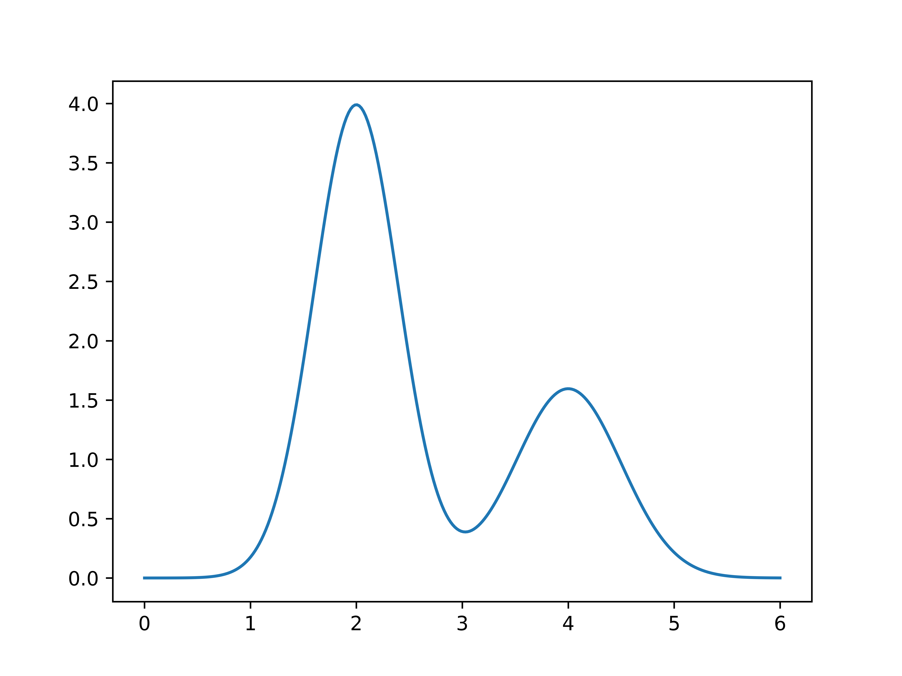
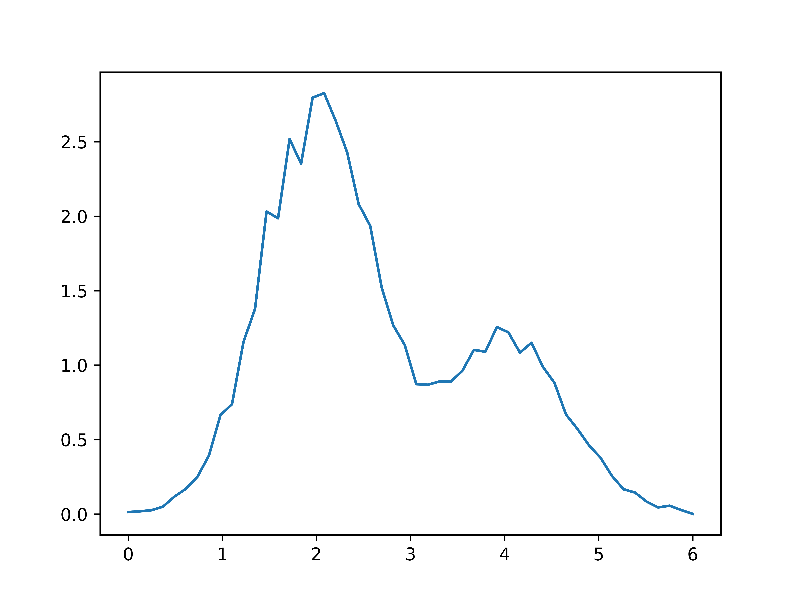
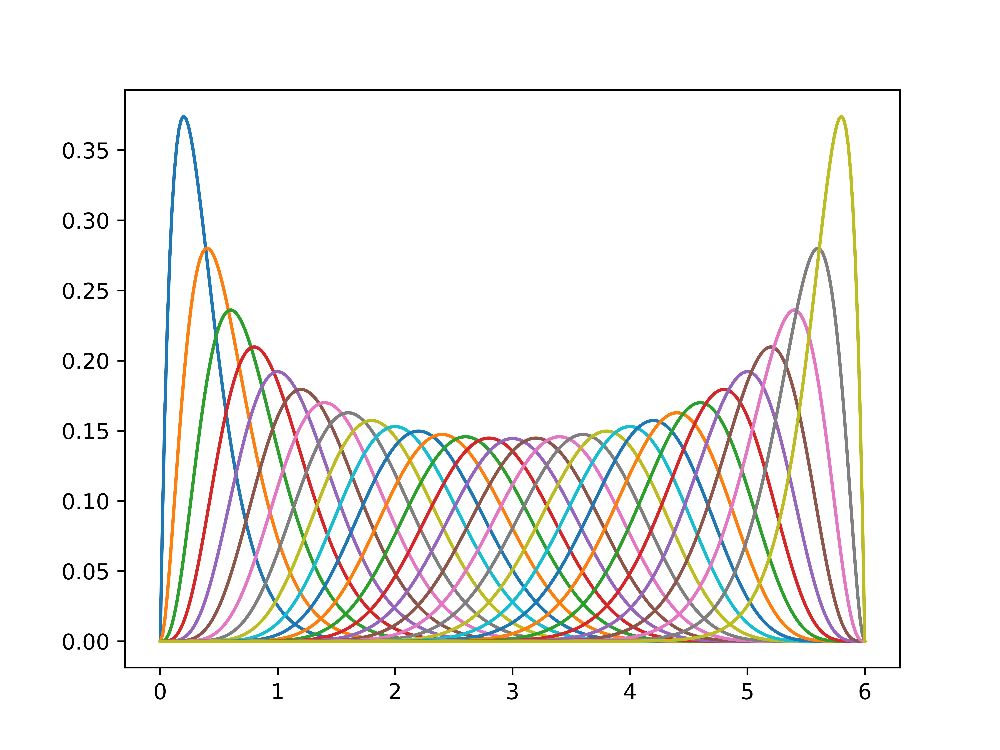

# Examples
## Reconstruction of the sum of two normal distributions with discrete kernel in basis of 30 cubic splines with zero boundary conditions.
* Define the function
```julia
using PyCall
include("src/gauss_error.jl")
include("src/kernels.jl")
a = 0.
b = 6.

function phi(x::Float64)
    mu1 = 2.
    mu2 = 4.
    n1 = 4.
    n2 = 2.
    sig1 = 0.4
    sig2 = 0.5

    norm(n, mu, sig, x) = n / sqrt(2 * pi*sig^2) * exp(-(x - mu)^2 / (2 * sig^2))
    return norm(n1, mu1, sig1, x) + norm(n2, mu2, sig2, x)
end

x = collect(range(a, stop=b, length=300))

using PyPlot
myplot = plot(x, phi.(x))
```



* Define kernel
```julia
function kernel(x::Float64, y::Float64)
    return getOpticsKernels("gaussian")(x, y)
end
```

* Integrate function multiplied by kernel and add noise
```julia
convolution = y -> quadgk(x -> kernel(x,y) * phi(x), a, b, maxevals=10^7)[1]
y = collect(range(a, stop = b, length=50))
ftrue = convolution.(y)
sig = 0.05*abs.(ftrue) +[0.01 for i = 1:Base.length(ftrue)]
using Compat, Random, Distributions
noise = []
for sigma in sig
    n = rand(Normal(0., sigma), 1)[1]
    push!(noise, n)
end
f = ftrue + noise
plot(y, f)
```


* Define basis
```julia
basis = BernsteinBasis(a, b, 30, "dirichlet")
for basis_function in basis.basis_functions
    plot(x, basis_function.f.(x))
end
```


* Discretize kernel
```julia
Kmn = discretize_kernel(basis, kernel, y)
```

* Model
```julia

```

* Solve
```julia
result = solve(model, Kmn, f, sig)
```

* Result
```julia
phivec = PhiVec(result["coeff"], basis, result["sig"])
x = collect(range(a, stop=b, length=5000))
plot(x, phi.(x))

phi_reconstructed = call(phivec, x)
phi_reconstructed_errors = errors(phivec, x)

plot(x, call(phivec, x))
fill_between(x, phi_reconstructed - phi_reconstructed_errors, phi_reconstructed + phi_reconstructed_errors, alpha=0.3)

```

