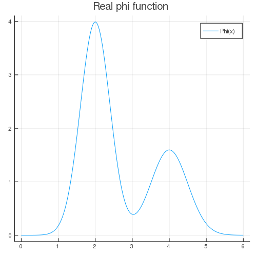
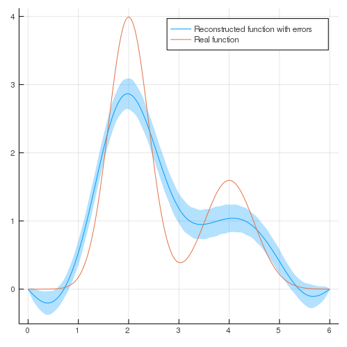

# Getting started

## Installation
To install StatReg.jl, start up Julia and type the following code-snipped into the REPL.
```julia
import Pkg
Pkg.clone("https://github.com/mipt-npm/StatReg.jl.git")
```

## Usage
Let's consider the simplest case of deconvolution.
The function to be reconstructed ``\varphi(x)`` is the sum of two Gaussian distributions.

```julia
using PyCall

a = 0
b = 6.

function phi(x::Real)
    mu1 = 2.
    mu2 = 4.
    n1 = 4.
    n2 = 2.
    sig1 = 0.4
    sig2 = 0.5
    norm(n, mu, sig, x) = n / sqrt(2 * pi*sig^2) * exp(-(x - mu)^2 / (2 * sig^2))
    return norm(n1, mu1, sig1, x) + norm(n2, mu2, sig2, x)
end

x = collect(range(a, stop=b, length=300))

myplot = plot(x, phi.(x))
```


After integration we get data and errors. `kernel` - kernel function, `y` - measurement points, `f` - data points, `sig` - data errors.

```julia
kernel(x::Real, y::Real) = getOpticsKernels("gaussian")(x, y)

convolution = y -> quadgk(x -> kernel(x,y) * phi(x), a, b, rtol=10^-5, maxevals=10^7)[1]
y = collect(range(a, stop=b, length=30))
ftrue = convolution.(y)

sig = 0.05*ftrue + [0.01 for i = 1:Base.length(ftrue)]

using Compat, Random, Distributions
noise = []
Random.seed!(1234)
for sigma in sig
    n = rand(Normal(0., sigma), 1)[1]
    push!(noise, n)
end

f = ftrue + noise
plot(y, f, title="Integrated function",label=["f(y)"])
```


Let's proceed to the reconstruction.

To reconstruct function you need to load data ``f(y)`` and data errors ``\delta f(y)`` and define kernel ``K(x, y)``.
There are two possibilities: use vector & matrix form or continuous form.
In the first case ``K(x, y)`` is matrix ``n \times m``, ``f(y)`` and ``\delta f(y)`` - n-dimensional vectors.
In the second case ``K(x, y)`` is a function, ``f(y)`` and ``\delta f(y)`` can be either functions or vectors.
If they are functions, knot vector ``y`` should be specified (points where the measurement is taken).

* We have already defined all needed data (`y` is a list of measurement points, `f` is a list of function values at these points, `sig` is a list of error in these points)

* Basis:

We will use Cubic Spline Basis with knots in data points and zero boundary conditions on both sides.

```julia
basis = CubicSplineBasis(y, "dirichlet")
for func in basis.basis_functions
    plot(x, func.f.(x))
end
```


* Model:

To reconstruct the function, we use matrix of the second derivatives as a prior information. Then we choose a solution model. It requires basis and a set of matrices that contain prior information, in our case it is smoothness. The method we use is called "EmpiricalBayes", it means that ``\alpha`` is chosen as a maximum of posterior probability ``P(\alpha | f)``. Also, it is important to set higher and lower bounds of ``\alpha`` and initial value for optimisation.

```julia
Omega = omega(basis, 2)
model = GaussErrorUnfolder(basis, [Omega], "EmpiricalBayes", nothing, [1e-8], [10.], [0.3])
```

* Reconstruction:

To reconstruct the function we use ``solve()`` that returns dictionary containing coefficients of basis function in the sum ``\varphi(x) = \sum_{k=1}^N coeff_n \psi_n(x)``, their errors ``errors_n`` (``\delta \varphi =  \sum_{k=1}^N errors_n \psi_n(x)``) and optimal parameter of smoothness ``\alpha``.

```julia
result = solve(model, kernel, f, sig, y)
```

* Results

Representation of results in a convenient way is possible with `PhiVec`:
```julia
phivec = PhiVec(result, basis)

phi_reconstructed = phivec.phi_function.(x)
phi_reconstructed_errors = phivec.error_function.(x)

plot(x, phi_reconstructed, ribbon=phi_reconstructed_errors, fillalpha=0.3, label="Reconstructed function with errors")
plot!(x, phi.(x), label="Real function")
```



Full notebook you can find in `examples/getting_started.ipynb`
